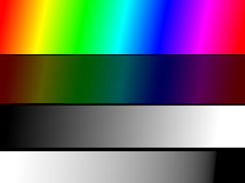
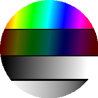
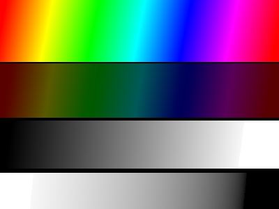

# pillow_snippet
some useful snippet and utils using pillow to handle image

# Requirements
* Pillow

# Install
```
pip install pillow-snippet
```

# Documentation
## Tutorial
* origin image  

* convert an Image to a circled Image
```
from pillow_snippet import convert
origin_image = Image.open('colorful_example.png')
image = origin_image.resize((200, 200))
circle_image = convert.circle_image(image)
circle_image.save("test_result/circle_image.png")
```


* delete the white pixel from an image  
    **it seems there is still white but if fact it is transparent. You can open the image in new tab to see more details**
```
mask = Mask(image)
exclude_white_image = mask.get_exclude_white_image(tolerance=8)
exclude_white_image.save("test_result/exclude_white_image.png")
```


* convert the imge to only contains red color
```
mask = Mask(image)
change_to_red_image = mask.convert_to_single_color("#ff0000ff")
change_to_red_image.save("test_result/change_to_red_image.png")
```


# Contribution
1. clone the code
2. make your commit
3. make test
```
sudo pip install .
python3 test.py
```
4. create a pull request
